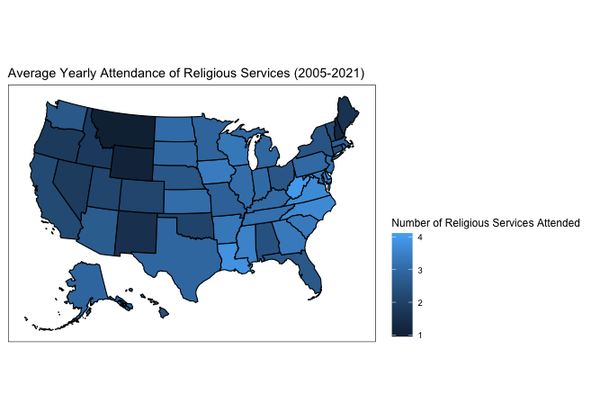
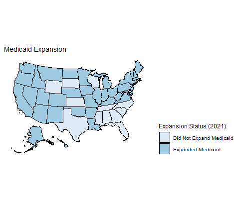
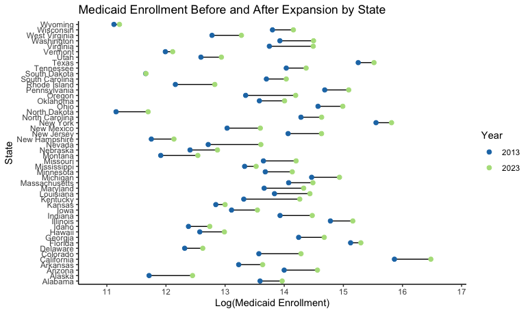

```{r setup, include=FALSE}
knitr::opts_chunk$set(echo = TRUE)
```


## Topic

In this project, we study the relationship between Medicaid expansion at the state-level and religiosity. More broadly, our goal is to estimate the effect of overall well-being on religious participation. Using Medicaid expansion under the Affordable Care Act as a natural experiment, we build on previous research indicating that economic conditions are correlated with religious behavior. Variations in Medicaid coverage across states can be used to identify how increases in financial well-being impact people's choices, behaviors, and beliefs. 

Research question:
What is the effect of Medicaid expansion on the attendance of religious services?

Datasets:
Our first dataset comes from the Panel Study of Income Dynamics from the Institute for Social Research at the University of Michigan. We use family-level panel survey data, including 16,504 observations. Most variables are measured every two years between 2005 and 2021. This survey contains information on state of residence, income, and religious behaviors.
Source: https://simba.isr.umich.edu/data/data.aspx

Our second dataset comes from Medicaid and has information on total Medicaid enrollment on a monthly basis between 2014 and 2022 as well as counts for the individuals enrolled in the new adult eligibility group when applicable. This gives us information on whether a state accepted Medicaid expansion.
Source: https://data.medicaid.gov/dataset/6c114b2c-cb83-559b-832f-4d8b06d6c1b9

Our third dataset comes from kff.org and has information on average monthly Medicaid enrollment by state before and after the Affordable Care Act was passed. We only used this dataset to generate a figure showing the change in Medicaid enrollment in 2013 and 2023.
Source: https://www.kff.org/health-reform/state-indicator/total-monthly-medicaid-and-chip-enrollment/?currentTimeframe=0&sortModel=%7B%22colId%22:%22Location%22,%22sort%22:%22asc%22%7D

Our datasets are related through state and time variables.

## Data wrangling:

Our primary data came from the Panel Study of Income Dynamics. We were able to select which variables and which years we wanted from this panel data. Most of the cleaning involved renaming variables into a useful name, putting the data into long format, and dealing with N/A or ‘don’t know’ (DK) values. However, transforming the data to tidy format increased the memory required to a prohibitive size. In order to perform exploratory analysis, we instead selected only a few of the variables of interest at a time.

We cleaned the second dataset containing information on Medicaid expansion so it could be merged with the survey data. This process included removing extraneous column variables and matching the state variable names to the codes used in the PSID data. We then created a dummy variable indicating whether Medicaid expansion was active for the given state and year using the other variables in the dataframe. Then, based on this variable, we defined the treatment group of states that expanded Medicaid at some point before 2022. 

We cleaned the third dataset by generating a year variable based on if the enrollment was pre- or post-Medicaid expansion and filtered out non-states.

Our primary outcome of interest is religious attendance, as it seems to be the most reliable indicator of religiosity. Another potential outcomes in the PSID dataset is religious donations. However, the capacity to donate is a function of both income and religiosity, which could complicate causal inference. We also chose not use to religious affiliation because respondents’ surveyed affiliations may remain constant even if the level of religious activity in their daily lives changes. 

## Exploratory Analysis
Attendance of religious services is highly right-skewed, meaning that a high proportion of the respondents attended none or only one service within the past year, but a smaller group of respondents attended many services. 
```{r echo=FALSE, out.width = "75%", fig.align = "center"}
knitr::include_graphics("output/Histogram_Attendance.png")
```
The attendance of religious services varies by state. In the map below, we observe that the Southeastern region of the US attends the most number of services, on average, and the West and Northeast attends the least. In the second map, we see that the percentage of respondents regularly attending religious services follows a similar geographic trend and at a similar magnitude. The most religious state attends about 4 times as many services per year on average than the least religious state (Montana, by this metric), and the most religious state is about 4 times as likely to attend religious services regularly than the least religious state.

```{r echo=FALSE, out.width = "75%", fig.align = "center"}

```
```{r echo=FALSE, out.width = "75%", fig.align = "center"}
knitr::include_graphics("output/Regular_Attendance_Map.png")
```
The next map displays the Medicaid expansion status of each state in 2021. In 2014, only 25 states expanded Medicaid immediately, but now we see that only 12 states remain having not expanded Medicaid (South Dakota and North Carolina have since expanded). The group of states that chose not to expand Medicaid are largely in the Southeast and Midwest. 
```{r echo=FALSE, out.width = "75%", fig.align = "center"}

```

The plot below shows how average attendance in states that expanded Medicaid differed from states that did not expand Medicaid over time relative to 2014. Attendance declined over time for both groups, most noticeably in 2021, influenced by the COVID-19 pandemic. We see that religious attendance was similar in both groups of states before 2014 (although slightly higher in non-expansion states), but because we don't have data for every year, it is hard to make conclusions about changes in slopes. 

```{r echo=FALSE, out.width = "75%", fig.align = "center"}
knitr::include_graphics("output/Event_Study.png")
```

Finally, we observe how Medicaid enrollment has changed in each state between before the Affordable Care Act passed. For this visualization, we log-transformed total Medicaid enrollment in each state, to better be able to compare states with different populations. In general, we see that Medicaid enrollment has increased in the last decade for all states, but some states saw more of an increase in enrollment than others. However, for the purposes of our analysis, the effects of increases in enrollment might not be large enough to be seen in full state outcomes, and changes in Medicaid enrollment may also be due to factors other than whether expanded Medicaid eligibility.

```{r echo=FALSE, out.width = "75%", fig.align = "center"}

```

## Econometric Analysis
### Motivation
Our research question is causal because we use regression analysis as a first step towards understanding how an exogenous shock in a person's well-being is associated with religious behaviors. Religion can be an influential factor in culture, politics, and daily life, so understanding what makes people change their religious behaviors and why is important to know. This question is not descriptive or predictive because our goal is not only to seek to describe or predict how religiosity changes given a change in health insurance coverage. That health insurance coverage is meant to signify a change in well-being that could potentially cause changes in religious behavior, which is the broader insight we are considering. 

### Methods
Write down 1-3 regression models that you could use to shed light on one or more of your research questions using your available data you have. No need to get fancy – a simple OLS or fixed effects regression is fine. I won’t prohibit you from trying something else you’ve learned in econometrics, but start with something simple. Explain all notation in your regressions and why they are appropriate to your situation.

Difference-in-differences regression model (two-way fixed effect model):
$attendance_{y,s} = α + β*(medicaidexpansion*post) + γ_y + λ_s + εy$

$attendance$ indicates the number of times in the past year the respondent has attended a religious services. Post indicates the time period after a state adopted Medicaid expansion. $medicaidexpansion$ indicates whether a state adopted Medicaid expansion during the data time frame. 
$β$ times 100 can be interpreted as the estimated percent change in religious attendance associated with expanding Medicaid. $α$ is a constant, $λ_s$ are the state fixed effect variables, $γ_y$ are year fixed effect variables, and $ε$ is the error term.

We can repeat the same model structure using percentage of respondents that regularly attend religious services as an outcome variable. In this model, $β$ times 100 can be interpreted as the estimated percent change in the percentage of regular religious service attenders associated with expanding Medicaid. 

Another regression alternative is to restrict the regression to households to those earning below the income eligibility requirement for Medicaid expansion. This depends on the federal poverty level and size of family, so we will choose to restrict the data to only households earning less than $40,000 per year as an approximation. 

### Results & Interpretation

```{r echo=FALSE, out.width = "75%", fig.align = "center"}

```

```{r echo=FALSE, out.width = "75%", fig.align = "center"}

```

```{r echo=FALSE, out.width = "75%", fig.align = "center"}

```
These results suggest a positive relationship between Medicaid expansion and attendance of religious events. $\beta$ in the first regression is .22, meaning that expanding Medicaid is associated with a 22 percent increase in number of services attended. This is significant at the 10 percent level. However, when the sample is restricted to lower-income households, $\beta$ loses significance, when it should gain significance, intuitively. The third regression, using regular attendance as the outcome variable, suggests no relationship with Medicaid expansion. 

There are several limits to accepting causal interpretation of these results. While we used expansion choice as a natural experiment, there are several factors that could be contributing to bias. We don't have yearly data for attendance, we do not include control variables, and country-wide state-level variation involves a lot of noise that makes determining expansion's true effect more difficult. There is a lot of measurement error in survey data which would cause a downward bias on the estimates. 

To improve this analysis, we could add control variables. For example, political affiliation could be an omitted variable correlated with whether a state expands Medicaid that also affects how religious attendance is trending over time. We could also seek to obtain data that was collected more often and more reliable than survey data, so we could more reliably compare expanded and non-expanded states. It would be helpful to more precisely define our treatment and comparison groups so that the treatment group only includes people who now qualify for Medicaid expansion while the comparison group only includes people who would have otherwise qualified for Medicaid expansion but live in a state that did not accept Medicaid expansion, rather than the entire populations of the comparison states.

We could also look at a more specific region of the country rather than the whole country to reduce the amount of noise and extraneous variation in the data. For example, we could compare otherwise similar states that differed in whether they expanded Medicaid, such as Wisconsin and Minnesota or Alabama and Louisiana. 


