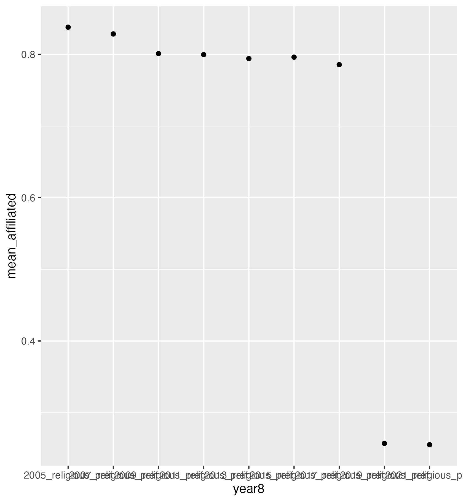

```{r setup, include=FALSE}
knitr::opts_chunk$set(echo = TRUE)
```

## Exploratory Analysis

Topic:
In this project, we will be studying Medicaid enrollment on the state-level and religiosity. More broadly we’re looking at the effect of income on religious participation. Using Medicaid expansion under the Affordable Care Act as a natural experiment, we build on previous research indicating that economic conditions are correlated with religious behavior. Variations in Medicaid coverage across states can be used to identify how increases in financial wellbeing impact household choices, behaviors, and beliefs. 

Research question:
What is the effect of Medicaid expansion on religious participation and religious affiliation?

Datasets:
Our first dataset comes from the Panel Study of Income Dynamics from the Institute for Social Research at the University of Michigan. We use family-level panel survey data, including 16,504 observations. Most variables are measured every two years between 2005 and 2021. This survey contains information on state of residence, income, and religious participation/affiliation.
Source: https://simba.isr.umich.edu/data/data.aspx

Our second dataset comes from Medicaid and has information on total Medicaid enrollment on a monthly basis between 2014 and 2022 as well as counts for the individuals enrolled in the new adult eligibility group when applicable. This gives us information on how many adults each month by state are enrolling in Medicaid overall and due to expansion of Medicaid.
Source: https://data.medicaid.gov/dataset/6c114b2c-cb83-559b-832f-4d8b06d6c1b9

We’ll use the dataset above to create a variable indicating whether a state adopted Medicaid expansion and the date it was implemented. Additionally, we will create a variable indicating the proportion of the population enrolled in Medicaid, using the dataset above and annual US Census data.
Source: https://data.census.gov/table/PEPPOP2019.PEPANNRES?q=population+state

Our datasets are related through state and time variables. 

## Data wrangling:

Our primary data came from the Panel Study of Income Dynamics. This data was relatively easy to clean since we were able to select what variables and what years we wanted data for. Most of the cleaning involved renaming variables into a useful name, putting the data into long format, and then getting rid of NA values. However, transforming the data to tidy format increased the memory required to a prohibitive size. In order to perform exploratory analysis, we instead selected only the variables of interest.

We cleaned the second dataset containing information on Medicaid expansion so that it can be merged with the survey data. This process included removing extraneous column variables and matching the state variable names to the codes used in the PSID data. We then created a dummy variable indicating whether Medicaid expansion was active for the given state and year using the other variables in the dataframe.

We have three outcomes of interest we will look at in order to get a measure of religiosity. Religious attendance, religious affiliation, and donations to religious organizations. Ultimately we will be able to look at how a state passing Medicaid expansion affects those three different outcomes of interest. 

After plotting histograms of income, donations, and attendance it shows that each is right skewed so we will need to log transform donations and attendance in order to use them. We also noticed some extreme values and after consulting the codebook realized many of those extreme values were for NA or didn’t know (DK). One of the extreme values we removed for the income variable was those who lost $999,999 or more since we figured that was most likely an outlier and the purpose of having income in the data is to figure out if they qualified for Medicaid or not. This is important because one of our tentative plans for our econometric analysis is to only include people who qualified for Medicaid before and after the expansion in our dataset.


## Findings

We find that religious affiliation, attendance at religious events, and donations to religious organizations have declined over time. 

We also find that income and donations to religious organizations as well as income and attendance at religious events have a weak negative correlation.

```{r pressure, echo=FALSE}

```

